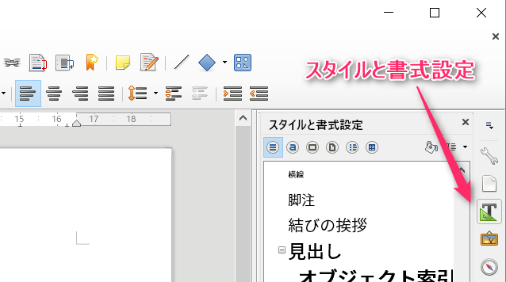

title: Pandoc入門：MarkdownからHTML・PDF・Writer/Word文書・スライドを生成する
author: 藤原 由来
date: 2017年8月4日
revealjs-url: reveal.js-3.4.0
theme: sky-sky-y
transition: fade
transitionSpeed: fast
slideNumber: true
...
```

----

# Pandocをインストールする

<!-- .slide: class="center" -->

----

# ターミナルを開く

- Linux/Mac: ターミナル
- Windows: コマンドプロンプト
    - 分かっている方は、お好きなターミナル・シェルでもOK
- 基本的なコマンド操作については、今回は説明しません
    - コマンドが苦手な方は「何ができるか」を覚えてもらえれば幸いです

----

# Pandocのインストール: インストーラ編

- Windows/Macの場合
- パッケージを直接落としてインストール
    1. [ここからパッケージをダウンロード](https://github.com/jgm/pandoc/releases/latest)
        - Windows: `.msi`, Mac: `.pkg`
    2. インストール

----

# Pandocのインストール: パッケージマネージャ編

- Mac([Homebrew](http://brew.sh/index_ja.html))
    - `$ brew install pandoc`
- Windows([Chocolatey](https://chocolatey.org/))
    - `> cinst -y pandoc`

----

# Pandocのインストール: Linux編

- Linux
    - [pandoc/INSTALL.md](https://github.com/jgm/pandoc/blob/master/INSTALL.md#linux) を参照
    - 各種パッケージマネージャでインストールできます
        - Debian, Ubuntu, Slackware, Arch, Fedora, NiXOS, openSUSE, and gentoo
        - 各々のパッケージマネージャで「pandoc」をsearch/installしてください
        - バージョンが古いことがあるので注意
    - ソースコードからビルド
        - Haskellのソースコードをビルドする必要があります
        - [Stack](https://docs.haskellstack.org/en/stable/README/)(Haskellビルドツール)を
        - ソースコード: [GitHub - jgm/pandoc](https://github.com/jgm/pandoc)

----

# wkhtmltopdfのインストール

- PDF出力のために必要
    - TeXLiveを入れていれば、LaTeX処理系も利用可能（説明略）
    - ただし、pLaTeXはNGなので、LuaLaTeX/XeLaTeXが必要です
- インストーラを直接落としてインストール
    1. [wkhtmltopdf - Downloads](http://wkhtmltopdf.org/downloads.html)からダウンロード
    2. インストール
- パッケージマネージャでインストール
    - Mac(Homebrew): `$ brew cask install wkhtmltopdf`
        - Caskの方なので注意
    - Windows(Chocolatey): `> cinst -y wkhtmltopdf`
    - Linux: 略（各々のパッケージマネージャで「wkhtmltopdf」をsearch/installしてください）

----

# 動作確認1: Pandoc単体

※ 藤原の環境：Windows (Chocolatey) + MSYS2

```
$ pandoc --version
$ pandoc --list-input-formats
$ pandoc --list-output-formats
$ echo "**Hello**" | pandoc -f markdown -t html
<p><strong>Hello</strong></p>
```

----

# 動作確認1: Pandoc単体

```
$ echo "**Hello**" | pandoc -f markdown -t html
```

- シェルの**パイプ**機能を使っています
    - `echo`が出す標準出力をパイプ (`|`)で`pandoc`の標準入力に渡す
    - `pandoc`は入力・出力ファイル名が与えられてない場合、標準入力・標準出力を使う
- `-f`: 入力フォーマット名 (from)
    - 使えるフォーマット名は `pandoc --list-input-formats` で確認できる
- `-t`: 出力フォーマット名 (to)
    - 使えるフォーマット名は `pandoc --list-output-formats` で確認できる

----

# 動作確認2: ファイルを入力

- 次の内容をテキストファイルで保存し、「hello.md」と保存する

```
# Hello
こんにちは
```

----

# 動作確認2: ファイルを入力

- コマンドを実行:

```
$ pandoc hello.md -o hello.html
```

- オプションのない引数(hello.md): 入力ファイル名
- `-o`: 出力ファイル名 (output)
    - `-t`（次スライド）を指定しない場合、拡張子から出力フォーマットを推測してくれる
- **注意: Pandocが対応している文字コードはUTF-8のみです**
    - UTF-8以外を扱う場合は、nkf/iconv/uconvなどの文字コード変換ツールをパイプ(`|`)に繋げます

----

# 動作確認3: Pandoc + wkhtmltopdf (PDF)

```
$ echo "**Hello**" | pandoc -f markdown -t html5 -o hello.pdf
```

- `-f`: 入力フォーマット名 (from)
- `-t`: 出力フォーマット名 (to)
    - 注意: wkhtmltopdfでPDFを出すときは `-t html5`を指定
        - 内部で文字通り、HTML5に変換してからPDFに出すので
- `-o`: 出力ファイル名 (output)
    - 注意: wkhtmltopdfでPDFを出すときは、`-o`の拡張子は`.pdf`を指定

----

# Pandocの基本的な使い方

<!-- .slide: class="center" -->

----

# これからやること

- Markdown ↔ LibreOffice Writer の相互変換を例にします
    - 他の書式に変換するときの基礎になります
    - MS Wordを扱うときは、ほぼ同じです

----

# これからやること

- Markdown文書からWriter文書に変換する
    - とりあえず変換してみる
    - 綺麗なWriter文書を生成する: reference機能
- Writer文書をMarkdownなどに変換する
- 以下の作業では、[GitHubリポジトリ](https://github.com/sky-y/osc-kyoto2017-pandoc)のsampleディレクトリにあるファイルを使います
- atarashii_kenpo.md: [あたらしい憲法のはなし(Markdown版)](https://github.com/nogajun/story_of_the_new_constitution)より
    - nogajunさん編、Public Domain

----

# とりあえず変換してみる: pandocコマンド

```
$ git clone https://github.com/sky-y/osc-kyoto2017-pandoc.git
$ cd sample
$ pandoc atarashii_kempo.md -o atarashii_kempo.odt
```

- `-o`: 出力ファイル名
    - 多くの場合拡張子で判断できる

----

# ファイルを開く

```
$ open atarashii_kempo.odt      # Mac
$ xdg-open atarashii_kempo.odt  # Linux (GNOME, KDE, Xfce)
> start atarashii_kempo.odt     # Windows
```

----

# 綺麗なWriter文書を生成する

- Pandocのreference機能を使う
    - (1) Pandocコマンドからreferenceファイルを生成
    - (2) reference.odtをWriterで編集する
    - (3) Pandocの変換時にreference.odtをオプションで指定する
        - もしくはユーザデータディレクトリに入れる
- Wordの場合は、「odt」を「docx」に読み替えると同様にできます

----

# (1) Pandocコマンドからreferenceファイルを生成

```
$ pandoc --print-default-data-file reference.odt > reference.odt
```

- コマンドオプションで指定する場合は「reference.odt」という名前でなくてよい
- ユーザデータディレクトリ(後述)に入れる場合は必ず「reference.odt」という名前にする

----

# (2) reference.odtをWriterで編集する

- reference.odtをLibreOfficeで開く
- reference.odtの内容はPandocから参照されない
    - デフォルトで「Hello World!」と表示されている部分のこと
    - 例えば表示用サンプルを置いてもいい
- 「スタイルと書式設定」から書式を変更

{ width=50% }

----

# (3) Pandocの変換時にテンプレートをオプションで指定する

注意: バージョンによって使用するオプションが違います

- `--reference-odt`: Pandoc 1.xの指定
- `--reference-doc`: Pandoc 2.xの指定
- バージョンは `pandoc -v` で分かります
- 実際に使えるコマンドは `pandoc -h`で分かります
    - UNIX系なら `pandoc -h | grep 'reference'` で絞れるはず

```
$ pandoc atarashii_kenpo.md --reference-odt=reference.odt -o atarashii_kenpo.odt
$ pandoc atarashii_kenpo.md --reference-doc=reference.odt -o atarashii_kenpo.odt
```

----

# 補足: reference.odtをユーザデータディレクトリに入れる

- ユーザデータディレクトリの場所: `pandoc -v` で出る
    - Windows: `C:\Users\ユーザ名\AppData\Roaming\pandoc`
    - Mac: `$HOME/.pandoc`
- このディレクトリに「reference.odt」という名前でテンプレートを入れると、次回からデフォルトで使ってくれる

----

# 具体的なノウハウ

- nogajunさん: [PandocとLibreOffice WriterでiDエディタのマニュアルを製本する, どうしてこうなった - Days of Speed(2014-12-06)](http://www.nofuture.tv/diary/20141206.html)
    - [nogajun/pandoc-writer](https://github.com/nogajun/pandoc-writer)の`pandoc-writer.odt`がテンプレートとして使える
- いくやさん: [PandocでMarkdownをODTに変換する - いくやの斬鉄日記](http://blog.goo.ne.jp/ikunya/e/826e6916307159c87afde0fe23c5e1e4)
    - 画像のサイズを整える (ImageMagickの`mogrify`コマンド)
    - 画像のDPIを変更する (同上)

----

# Writer文書からMarkdown/reST文書に変換してみる

- nogajunさんの`pandoc-writer.odt`を変換してみる
    - [nogajun/pandoc-writer](https://github.com/nogajun/pandoc-writer) (CC BY-SA 4.0)
- Markdown (Pandoc's)
    - `$ pandoc pandoc-writer.odt -o pandoc-writer.md`
- reStructuredText (Sphinxなどで使用)
    - `$ pandoc pandoc-writer.odt -o pandoc-writer.rst`

----

# Writer文書からLaTeX文書に変換してみる

- LaTeX (ヘッダ・フッタ抜き)
    - `$ pandoc pandoc-writer.odt -o pandoc-writer.tex`
    - あとで別のLaTeXソースファイルに貼り付けたり、スクリプトで組み入れたりするのに便利
    - PandocはpLaTeXに対応しないので、pLaTeX前提ならこちらがおすすめ
- LaTeX (ヘッダ・フッタ入り)
    - `$ pandoc -s pandoc-writer.odt -o pandoc-writer.tex`
        - `-s`: 文書として完全になるようにヘッダ・フッタを付ける (standaloneモード)
    - 注意：LuaLaTeX/XeLaTeXのみ対応
        - `$ pandoc -s pandoc-writer.odt --latex-engine=lualatex -o pandoc-writer.tex`
        - `--latex-engine=`オプションで`lualatex` or `xelatex`を指定
    - 日本語設定
        - [LuaLaTeX: LuaTeX-jaの使い方](https://ja.osdn.net/projects/luatex-ja/wiki/LuaTeX-ja%E3%81%AE%E4%BD%BF%E3%81%84%E6%96%B9)
        - XeLaTeXを使う場合: [BXjscls がまた新しくなった（v1.1a） - マクロツイーター](http://d.hatena.ne.jp/zrbabbler/20160228/1456622107)

----

# Q&A

<!-- .slide: class="center" -->

----

# Pandocの応用

<!-- .slide: class="center" -->

----

# Pandocの応用

- オフィスにある大量の文書を別の書式に変換したい
- Markdownでスライドショーを作りたい
- フィルタ機能
- おまけ：電子書籍について

----

# オフィスにある大量の文書を別の書式に変換したい

処理したいファイルが大量にある場合は、スクリプトにPandocを組み込みます。

1. 下準備: 他のツールなどで、なんとかしてPandocが処理できる書式に変換する
    - おすすめ: HTML（多くのツールでエクスポートできるので）
2. Pandocをスクリプトの中で使う
    - シェルスクリプトで直接使う
    - スクリプト言語の外部コマンド機能で呼ぶ
    - スクリプト言語のライブラリから呼ぶ（古い場合があるので注意）

----

# Pandocをスクリプトとして呼ぶ例（その他）

- 各種エディタのプラグイン・拡張で対応
    - Atom, VS Code, ...
- 特にVimの場合
    - LaTeX文書を書くときの補助として「Markdownを書いてその場でLaTeXに変換する」拡張がある
    - [TeXで書くのめんどくさい部分はmarkdownで書いちゃえば最強じゃないかな?【Vim + pandoc】 - Qiita](http://qiita.com/ssh0/items/679ac9dd3c33b0e5cd90)

----

# Markdownでスライドショーを作りたい

このスライド自体をPandocで生成しました

- [Pandoc's Markdown](http://pandoc.org/MANUAL.html#pandocs-markdown)の書式に従って原稿を書く
    - もちろんこれ以外の書式でも、Pandocが対応していれば書けます
- Pandocで変換する
    - 今回は「reveal.js」形式（HTML+JavaScriptによるプレゼン）に変換
    - `$ pandoc input.p.md -s -f markdown -t revealjs -o index.html`
        - 実際のファイルは次スライドで
        - `-s`: standalone (ヘッダ・フッタの付いた完全な文書を出力)
- アップロードする
    - [GitHub Pages](https://pages.github.com/)を使うと、直接GitHubにpushすればアップロードできます
        - この場合は、`.nojekyll`という空ファイルを置かないと、404エラーになるので注意
- その他 LaTeX Beamer にも変換できます

----

# 実際のソースコード

- このスライド自体がGitHub Pagesにアップロードされています
- [GitHubリポジトリ](https://github.com/sky-y/osc-kyoto2017-pandoc) 
    - [発表用スライド (HTML/reveal.js)](https://sky-y.github.io/osc-kyoto2017-pandoc/)
    - [スライドのMarkdownソース (Pandoc's Markdown)](https://raw.githubusercontent.com/sky-y/osc-kyoto2017-pandoc/master/index.p.md)
    - [復習用資料 (GitHub Flavored Markdown)](https://github.com/sky-y/osc-kyoto2017-pandoc/blob/master/index_github.md)
    - 変換の補助にGulpを使っています（`make`のようなもの）

----

# フィルタ機能

- 中間文書をJSON形式に出す
- それを外部スクリプトが標準入力で受け取り処理する
- それを標準出力に出して、Pandocに戻す

{ width=80% }

----

# フィルタ機能ができること

- 詳しくは[Pandoc Filters (GitHub Wiki)](https://github.com/jgm/pandoc/wiki/Pandoc-Filters)を参照
- 引用を入れる (pandoc-citeproc, pandoc-crossref)
    - [MarkdownとPandocを使って論文っぽい文章を書く | inoblog](https://inody1991.tumblr.com/post/134742076815/markdown%E3%81%A8pandoc%E3%82%92%E4%BD%BF%E3%81%A3%E3%81%A6%E8%AB%96%E6%96%87%E3%81%A3%E3%81%BD%E3%81%84%E6%96%87%E7%AB%A0%E3%82%92%E6%9B%B8%E3%81%8F)
- 図表を入れる
    -  ([mermaid-filter](https://github.com/raghur/mermaid-filter)): [mermaid](https://knsv.github.io/mermaid/#mermaid)で使えるフローチャート、ガントチャート、シーケンス図
    - [pantable](https://github.com/ickc/pantable): CSVファイルを表として読み込む
- 外部ファイルの読み込み
    - Node.jsで書くチュートリアル: [pandocでMarkdownを拡張しコードをインポート出来るfilterを書く | Web Scratch](http://efcl.info/2014/0301/res3692/)
- 過去のチュートリアル「HaskellでPandocフィルタを実装する」
    - [Haskell with Skype Pandocチュートリアル 第2回](https://github.com/sky-y/haskell-skype-pandoc-2)

----

# おまけ：電子書籍について

- PandocもEPUB出力できる
    - 素朴なEPUBなら日本語でも`-t epub3`で出力できる
- Markdown→EPUB変換には「[でんでんコンバーター](https://conv.denshochan.com/)」をおすすめします
    - ルビや縦中横が使えて、細かい設定や組版がしやすい
    - 記法: [でんでんマークダウン](https://conv.denshochan.com/markdown)
        - PHP Markdown Extraベース
- 提案
    - Pandocに対応する好きな記法で原稿を書く
    - `pandoc -t markdown_phpextra`で、でんでんマークダウン向けに変換
    - [でんでんエディター](https://edit.denshochan.com/)にペーストして仕上げる

----

# まとめ・お知らせ

----

# 今日やったこと

- Pandocの概要
- Pandocをインストールする
- Pandocの基本的な使い方
    - Markdown ↔ LibreOffice Writer を例に
- Pandocの応用

----

# Pandocの今後の課題

- 日本語に特化した文書フォーマットにほとんど対応していない
    - 書籍におけるルビや圏点など
    - 日本語コミュニティの必要性
- 表形式の文書は対応していない
    - Excel文書など→Excel方眼紙への対策には致命的
    - サードパーティのプリプロセッサにより部分的に変換する手段はある
        - 一部の図表（Graphvizなど）はこの方法で取り込むことができる
    - 参考: [Excel方眼紙公開討論会 (9/30＠東京)](https://www.forguncy.com/information/events/excelforguncy)

----

# 日本Pandocユーザ会

- Webサイト (リニューアル予定)
    - <http://sky-y.github.io/site-pandoc-jp/>
- Slackを始めました（**どなたでも歓迎します！**）
    - [Slack登録フォーム](https://docs.google.com/forms/d/e/1FAIpQLScdXINuMSFlKFk9YClkDUtvZNaYFWVSiJyleYjtMVbIHqwJhA/viewform)

----

# ドキュメンテーションWiki

- [ドキュメンテーションWiki (GitHub)](https://github.com/doc-wiki-jp/wiki/wiki)
- 誰でも編集歓迎します（要GitHubアカウント）

----

# Q&A

- 連絡先
    - メールフォーム: <https://goo.gl/forms/FPB22jv9S5NP4fpx2>
    - Twitter: [すかいゆき・藤原 惟 \@sky_y](https://twitter.com/sky_y)
    - Facebook: <https://fb.me/sky.yuki.f>