% あたらしい憲法のはなし  
% 文部省

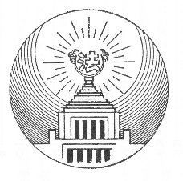

---

# 一 憲法

みなさん、あたらしい憲法ができました。そうして昭和二十二年五月三日から、私たち日本國民は、この憲法を守ってゆくことになりました。このあたらしい憲法をこしらえるために、たくさんの人々が、たいへん苦心をなさいました。ところでみなさんは、憲法というものはどんなものかごぞんじですか。じぶんの身にかゝわりのないことのようにおもっている人はないでしょうか。もしそうならば、それは大きなまちがいです。

國の仕事は、一日も休むことはできません。また、國を治めてゆく仕事のやりかたは、はっきりときめておかなければなりません。そのためには、いろ／＼規則がいるのです。この規則はたくさんありますが、そのうちで、いちばん大事な規則が憲法です。

國をどういうふうに治め、國の仕事をどういうふうにやってゆくかということをきめた、いちばん根本になっている規則が憲法です。もしみなさんの家の柱がなくなったとしたらどうでしょう。家はたちまちたおれてしまうでしょう。いま國を家にたとえると、ちょうど柱にあたるものが憲法です。もし憲法がなければ、國の中におゝぜいの人がいても、どうして國を治めてゆくかということがわかりません。それでどこの國でも、憲法をいちばん大事な規則として、これをたいせつに守ってゆくのです。國でいちばん大事な規則は、いいかえれば、いちばん高い位にある規則ですから、これを國の「最高法規」というのです。

ところがこの憲法には、いまおはなししたように、國の仕事のやりかたのほかに、もう一つ大事なことが書いてあるのです。それは國民の権利のことです。この権利のことは、あとでくわしくおはなししますから、こゝではたゞ、なぜそれが、國の仕事のやりかたをきめた規則と同じように大事であるか、ということだけをおはなししておきましょう。

みなさんは日本國民のうちのひとりです。國民のひとり／＼が、かしこくなり、強くならなければ、國民ぜんたいがかしこく、また、強くなれません。國の力のもとは、ひとり／＼の國民にあります。そこで國は、この國民のひとり／＼の力をはっきりとみとめて、しっかりと守ってゆくのです。そのために、國民のひとり／＼に、いろ／＼大事な権利があることを、憲法できめているのです。この國民の大事な権利のことを「基本的人権」というのです。これも憲法の中に書いてあるのです。

そこでもういちど、憲法とはどういうものであるかということを申しておきます。憲法とは、國でいちばん大事な規則、すなわち「最高法規」というもので、その中には、だいたい二つのことが記されています。その一つは、國の治めかた、國の仕事のやりかたをきめた規則です。もう一つは、國民のいちばん大事な権利、すなわち「基本的人権」をきめた規則です。このほかにまた憲法は、その必要により、いろ／＼のことをきめることがあります。こんどの憲法にも、あとでおはなしするように、これからは戰爭をけっしてしないという、たいせつなことがきめられています。

これまであった憲法は、明治二十二年にできたもので、これは明治天皇がおつくりになって、國民にあたえられたものです。しかし、こんどのあたらしい憲法は、日本國民がじぶんでつくったもので、日本國民ぜんたいの意見で、自由につくられたものであります。この國民ぜんたいの意見を知るために、昭和二十一年四月十日に総選挙が行われ、あたらしい國民の代表がえらばれて、その人々がこの憲法をつくったのです。それで、あたらしい憲法は、國民ぜんたいでつくったということになるのです。

みなさんも日本國民のひとりです。そうすれば、この憲法は、みなさんのつくったものです。みなさんは、じぶんでつくったものを、大事になさるでしょう。こんどの憲法は、みなさんをふくめた國民ぜんたいのつくったものであり、國でいちばん大事な規則であるとするならば、みなさんは、國民のひとりとして、しっかりとこの憲法を守ってゆかなければなりません。そのためには、まずこの憲法に、どういうことが書いてあるかを、はっきりと知らなければなりません。

みなさんが、何かゲームのために規則のようなものをきめるときに、みんないっしょに書いてしまっては、わかりにくい[^1]でしょう。國の規則もそれと同じで、一つ／＼事柄にしたがって分けて書き、それに番号をつけて、第何條、第何條というように順々に記します。こんどの憲法は、第一條から第百三條まであります。そうしてそのほかに、前書が、いちばんはじめにつけてあります。これを「前文」といいます。

[^1]: 「わかりにくい」は底本では「わかりくい」

この前文には、だれがこの憲法をつくったかということや、どんな考えでこの憲法の規則ができているかということなどが記されています。この前文というものは、二つのはたらきをするのです。その一つは、みなさんが憲法をよんで、その意味を知ろうとするときに、手びきになることです。つまりこんどの憲法は、この前文に記されたような考えからできたものですから、前文にある考えと、ちがったふうに考えてはならないということです。もう一つのはたらきは、これからさき、この憲法をかえるときに、この前文に記された考え方と、ちがうようなかえかたをしてはならないということです。

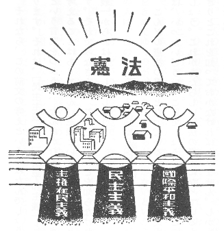

それなら、この前文の考えというのはなんでしょう。いちばん大事な考えが三つあります。それは、「民主主義」と「國際平和主義」と「主権在民主義」です。「主義」という言葉をつかうと、なんだかむずかしくきこえますけれども、少しもむずかしく考えることはありません。主義というのは、正しいと思う、もののやりかたのことです。それでみなさんは、この三つのことを知らなければなりません。まず「民主主義」からおはなししましょう。

# 二 民主主義とは

こんどの憲法の根本となっている考えの第一は民主主義です。ところで民主主義とは、いったいどういうことでしょう。みなさんはこのことばを、ほう／″＼できいたでしょう。これがあたらしい憲法の根本になっているものとすれば、みなさんは、はっきりとこれを知っておかなければなりません。しかも正しく知っておかなければなりません。

みなさんがおゝぜいあつまって、いっしょに何かするときのことを考えてごらんなさい。だれの意見で物事をきめますか。もしもみんなの意見が同じなら、もんだいはありません。もし意見が分かれたときは、どうしますか。ひとりの意見できめますか。二人の意見できめますか。それともおゝぜいの意見できめますか。どれがよいでしょう。ひとりの意見が、正しくすぐれていて、おゝぜいの意見がまちがっておとっていることもあります。しかし、そのはんたいのことがもっと多いでしょう。そこで、まずみんなが十分にじぶんの考えをはなしあったあとで、おゝぜいの意見で物事をきめてゆくのが、いちばんまちがいがないということになります。そうして、あとの人は、このおゝぜいの人の意見に、すなおにしたがってゆくのがよいのです。このなるべくおゝぜいの人の意見で、物事をきめてゆくことが、民主主義のやりかたです。

國を治めてゆくのもこれと同じです。わずかの人の意見で國を治めてゆくのは、よくないのです。國民ぜんたいの意見で、國を治めてゆくのがいちばんよいのです。つまり國民ぜんたいが、國を治めてゆく――これが民主主義の治めかたです。

しかし國は、みなさんの学級とはちがいます。國民ぜんたいが、ひとところにあつまって、そうだんすることはできません。ひとり／＼の意見をきいてまわることもできません。そこで、みんなの代わりになって、國の仕事のやりかたをきめるものがなければなりません。それが國会です。國民が、國会の議員を選挙するのは、じぶんの代わりになって、國を治めてゆく者をえらぶのです。だから國会では、なんでも、國民の代わりである議員のおゝぜいの意見で物事をきめます。そうしてほかの議員は、これにしたがいます。これが國民ぜんたいの意見で物事をきめたことになるのです。これが民主主義です。ですから、民主主義とは、國民ぜんたいで、國を治めてゆくことです。みんなの意見で物事をきめてゆくのが、いちばんまちがいがすくないのです。だから民主主義で國を治めてゆけば、みなさんは幸福になり、また國もさかえてゆくでしょう。

國は大きいので、このように國の仕事を國会の議員にまかせてきめてゆきますから、國会は國民の代わりになるものです。この「代わりになる」ということを「代表」といいます。まえに申しましたように、民主主義は、國民ぜんたいで國を治めてゆくことですが、國会が國民ぜんたいを代表して、國のことをきめてゆきますから、これを「代表制民主主義」のやりかたといいます。

しかしいちばん大事なことは、國会にまかせておかないで、國民が、じぶんで意見をきめることがあります。こんどの憲法でも、たとえばこの憲法をかえるときは、國会だけできめないで、國民ひとり／＼が、賛成か反対かを投票してきめることになっています。このときは、國民が直接に國のことをきめますから、これを「直接民主主義」のやりかたといいます。あたらしい憲法は、代表制民主主義と直接民主主義と、二つのやりかたで國を治めてゆくことにしていますが、代表制民主主義のやりかたのほうが、おもになっていて、直接民主主義のやりかたは、いちばん大事なことにかぎられているのです。だからこんどの憲法は、だいたい代表制民主主義のやりかたになっているといってもよいのです。

みなさんは日本國民のひとりです。しかしまだこどもです。國のことは、みなさんが二十歳になって、はじめてきめてゆくことができるのです。國会の議員をえらぶのも、國のことについて投票するのも、みなさんが二十歳になってはじめてできることです。みなさんのおにいさんや、おねえさんには、二十歳以上の方もおいででしょう。そのおにいさんやおねえさんが、選挙の投票にゆかれるのをみて、みなさんはどんな氣がしましたか。いまのうちに、よく勉強して、國を治めることや、憲法のことなどを、よく知っておいてください。もうすぐみなさんも、おにいさんやおねえさんといっしょに、國のことを、じぶんできめてゆくことができるのです。みなさんの考えとはたらきで國が治まってゆくのです。みんながなかよく、じぶんで、じぶんの國のことをやってゆくくらい、たのしいことはありません。これが民主主義というものです。

# 三 國際平和主義

國の中で、國民ぜんたいで、物事をきめてゆくことを、民主主義といいましたが、國民の意見は、人によってずいぶんちがっています。しかし、おゝぜいのほうの意見に、すなおにしたがってゆき、またそのおゝぜいのほうも、すくないほうの意見をよくきいてじぶんの意見をきめ、みんなが、なかよく國の仕事をやってゆくのでなければ、民主主義のやりかたは、なりたたないのです。

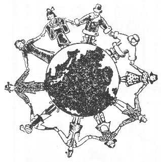

これは、一つの國について申しましたが、國と國との間のことも同じことです。じぶんの國のことばかりを考え、じぶんの國のためばかりを考えて、ほかの國の立場を考えないでは、世界中の國が、なかよくしてゆくことはできません。世界中の國が、いくさをしないで、なかよくやってゆくことを、國際平和主義といいます。だから民主主義ということは、この國際平和主義と、たいへんふかい関係があるのです。こんどの憲法で民主主義のやりかたをきめたからには、またほかの國にたいしても國際平和主義でやってゆくということになるのは、あたりまえであります。この國際平和主義をわすれて、じぶんの國のことばかり考えていたので、とうとう戰爭をはじめてしまったのです。そこであたらしい憲法では、前文の中に、これからは、この國際平和主義でやってゆくということを、力強いことばで書いてあります。またこの考えが、あとでのべる戰爭の放棄、すなわち、これからは、いっさい、いくさはしないということをきめることになってゆくのであります。

# 四 主権在民主義

みなさんがあつまって、だれがいちばんえらいかをきめてごらんなさい。いったい「いちばんえらい」というのは、どういうことでしょう。勉強のよくできることでしょうか。それとも力の強いことでしょうか。いろ／＼きめかたがあってむずかしいことです。

國では、だれが「いちばんえらい」といえるでしょう。もし國の仕事が、ひとりの考えできまるならば、そのひとりが、いちばんえらいといわなければなりません。もしおおぜいの考えできまるなら、そのおゝぜいが、みないちばんえらいことになります。もし國民ぜんたいの考えできまるならば、國民ぜんたいが、いちばんえらいのです。こんどの憲法は、民主主義の憲法ですから、國民ぜんたいの考えで國を治めてゆきます。そうすると、國民ぜんたいがいちばん、えらいといわなければなりません。

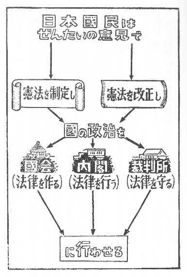

國を治めてゆく力のことを「主権」といいますが、この力が國民ぜんたいにあれば、これを「主権は國民にある」といいます。こんどの憲法は、いま申しましたように、民主主義を根本の考えとしていますから、主権は、とうぜん日本國民にあるわけです。そこで前文の中にも、また憲法の第一條にも、「主権が國民に存する」とはっきりかいてあるのです。主権が國民にあることを、「主権在民」といいます。あたらしい憲法は、主権在民という考えでできていますから、主権在民主義の憲法であるということになるのです。

みなさんは、日本國民のひとりです。主権をもっている日本國民のひとりです。しかし、主権は日本國民ぜんたいにあるのです。ひとり／＼が、べつ／＼にもっているのではありません。ひとり／＼が、みなじぶんがいちばんえらいと思って、勝手なことをしてもよいということでは、けっしてありません。それは民主主義にあわないことになります。みなさんは、主権をもっている日本國民のひとりであるということに、ほこりをもつとともに、責任を感じなければなりません。よいこどもであるとともに、よい國民でなければなりません。

# 五 天皇陛下

こんどの戰爭で、天皇陛下は、たいへんごくろうをなさいました。なぜならば、古い憲法では、天皇をお助けして國の仕事をした人々は、國民ぜんたいがえらんだものでなかったので、國民の考えとはなれて、とう／＼戰爭になったからです。そこで、これからさき國を治めてゆくについて、二度とこのようなことのないように、あたらしい憲法をこしらえるとき、たいへん苦心をいたしました。ですから、天皇は、憲法で定めたお仕事だけをされ、政治には関係されないことになりました。

憲法は、天皇陛下を「象徴」としてゆくことにきめました。みなさんは、この象徴ということを、はっきり知らなければなりません。日の丸の國旗を見れば、日本の國をおもいだすでしょう。國旗が國の代わりになって、國をあらわすからです。みなさんの学校の記章を見れば、どこの学校の生徒かがわかるでしょう。記章が学校の代わりになって、学校をあらわすからです。いまこゝに何か眼に見えるものがあって、ほかの眼に見えないものの代わりになって、それをあらわすときに、これを「象徴」ということばでいいあらわすのです。こんどの憲法の第一條は、天皇陛下を「日本國の象徴」としているのです。つまり天皇陛下は、日本の國をあらわされるお方ということであります。

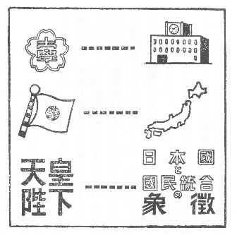

また憲法第一條は、天皇陛下を「日本國民統合の象徴」であるとも書いてあるのです。「統合」というのは「一つにまとまっている」ということです。つまり天皇陛下は、一つにまとまった日本國民の象徴でいらっしゃいます。これは、私たち日本國民ぜんたいの中心としておいでになるお方ということなのです。それで天皇陛下は、日本國民ぜんたいをあらわされるのです。

このような地位に天皇陛下をお置き申したのは、日本國民ぜんたいの考えにあるのです。これからさき、國を治めてゆく仕事は、みな國民がじぶんでやってゆかなければなりません。天皇陛下は、けっして神様ではありません。國民と同じような人間でいらっしゃいます。ラジオのほうそうもなさいました。小さな町のすみにもおいでになりました。ですから私たちは、天皇陛下を私たちのまん中にしっかりとお置きして、國を治めてゆくについてごくろうのないようにしなければなりません。これで憲法が天皇陛下を象徴とした意味がおわかりでしょう。

# 六 戰爭の放棄

みなさんの中には、こんどの戰爭に、おとうさんやにいさんを送りだされた人も多いでしょう。ごぶじにおかえりになったでしょうか。それともとう／＼おかえりにならなかったでしょうか。また、くうしゅうで、家やうちの人を、なくされた人も多いでしょう。いまやっと戰爭はおわりました。二度とこんなおそろしい、かなしい思いをしたくないと思いませんか。こんな戰爭をして、日本の國はどんな利益があったでしょうか。何もありません。たゞ、おそろしい、かなしいことが、たくさんおこっただけではありませんか。戰爭は人間をほろぼすことです。世の中のよいものをこわすことです。だから、こんどの戰爭をしかけた國には、大きな責任があるといわなければなりません。このまえの世界戰爭のあとでも、もう戰爭は二度とやるまいと、多くの國々ではいろ／＼考えましたが、またこんな大戰爭をおこしてしまったのは、まことに残念なことではありませんか。

そこでこんどの憲法では、日本の國が、けっして二度と戰爭をしないように、二つのことをきめました。その一つは、兵隊も軍艦も飛行機も、およそ戰爭をするためのものは、いっさいもたないということです。これからさき日本には、陸軍も海軍も空軍もないのです。これを戰力の放棄といいます。「放棄」とは「すててしまう」ということです。しかしみなさんは、けっして心ぼそく思うことはありません。日本は正しいことを、ほかの國よりさきに行ったのです。世の中に、正しいことぐらい強いものはありません。

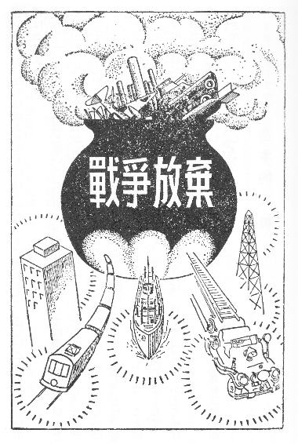

もう一つは、よその國と爭いごとがおこったとき、けっして戰爭によって、相手をまかして、じぶんのいいぶんをとおそうとしないということをきめたのです。おだやかにそうだんをして、きまりをつけようというのです。なぜならば、いくさをしかけることは、けっきょく、じぶんの國をほろぼすようなはめになるからです。また、戰爭とまでゆかずとも、國の力で、相手をおどすようなことは、いっさいしないことにきめたのです。これを戰爭の放棄というのです。そうしてよその國となかよくして、世界中の國が、よい友だちになってくれるようにすれば、日本の國は、さかえてゆけるのです。

みなさん、あのおそろしい戰爭が、二度とおこらないように、また戰爭を二度とおこさないようにいたしましょう。

# 七 基本的人権

くうしゅうでやけたところへ行ってごらんなさい。やけたゞれた土から、もう草が青々とはえています。みんな生き／＼としげっています。草でさえも、力強く生きてゆくのです。ましてやみなさんは人間です。生きてゆく力があるはずです。天からさずかったしぜんの力があるのです。この力によって、人間が世の中に生きてゆくことを、だれもさまたげてはなりません。しかし人間は、草木とちがって、たゞ生きてゆくというだけではなく、人間らしい生活をしてゆかなければなりません。この人間らしい生活には、必要なものが二つあります。それは「自由」ということと、「平等」ということです。

人間がこの世に生きてゆくからには、じぶんのすきな所に住み、じぶんのすきな所に行き、じぶんの思うことをいい、じぶんのすきな教えにしたがってゆけることなどが必要です。これらのことが人間の自由であって、この自由は、けっして奪われてはなりません。また、國の力でこの自由を取りあげ、やたらに刑罰を加えたりしてはなりません。そこで憲法は、この自由は、けっして侵すことのできないものであることをきめているのです。

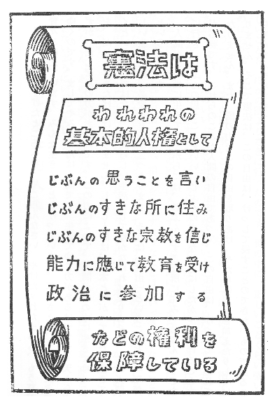

またわれわれは、人間である以上はみな同じです。人間の上に、もっとえらい人間があるはずはなく、人間の下に、もっといやしい人間があるわけはありません。男が女よりもすぐれ、女が男よりもおとっているということもありません。みな同じ人間であるならば、この世に生きてゆくのに、差別を受ける理由はないのです。差別のないことを「平等」といいます。そこで憲法は、自由といっしょに、この平等ということをきめているのです。

國の規則の上で、何かはっきりとできることがみとめられていることを、「権利」といいます。自由と平等とがはっきりみとめられ、これを侵されないとするならば、この自由と平等とは、みなさんの権利です。これを「自由権」というのです。しかもこれは人間のいちばん大事な権利です。このいちばん大事な人間の権利のことを「基本的人権」といいます。あたらしい憲法は、この基本的人権を、侵すことのできない永久に與えられた権利として記しているのです。これを基本的人権を「保障する」というのです。

しかし基本的人権は、こゝにいった自由権だけではありません。まだほかに二つあります。自由権だけで、人間の國の中での生活がすむものではありません。たとえばみなさんは、勉強をしてよい國民にならなければなりません。國はみなさんに勉強をさせるようにしなければなりません。そこでみなさんは、教育を受ける権利を憲法で與えられているのです。この場合はみなさんのほうから、國にたいして、教育をしてもらうことを請求できるのです。これも大事な基本的人権ですが、これを「請求権」というのです。爭いごとのおこったとき、國の裁判所で、公平にさばいてもらうのも、裁判を請求する権利といって、基本的人権ですが、これも請求権であります。

それからまた、國民が、國を治めることにいろ／＼関係できるのも、大事な基本的人権ですが、これを「参政権」といいます。國会の議員や知事や市町村長などを選挙したり、じぶんがそういうものになったり、國や地方の大事なことについて投票したりすることは、みな参政権です

みなさん、いままで申しました基本的人権は大事なことですから、もういちど復習いたしましょう。みなさんは、憲法で基本的人権というりっぱな強い権利を與えられました。この権利は、三つに分かれます。第一は自由権です。第二は請求権です。第三は参政権です。

こんなりっぱな権利を與えられましたからには、みなさんは、じぶんでしっかりとこれを守って、失わないようにしてゆかなければなりません。しかしまた、むやみにこれをふりまわして、ほかの人に迷惑をかけてはいけません。ほかの人も、みなさんと同じ権利をもっていることを、わすれてはなりません。國ぜんたいの幸福になるよう、この大事な基本的人権を守ってゆく責任があると、憲法に書いてあります。

# 八 國会

民主主義は、國民が、みんなでみんなのために國を治めてゆくことです。しかし、國民の数はたいへん多いのですから、だれかが、國民ぜんたいに代わって國の仕事をするよりほかはありません。この國民に代わるものが「國会」です。まえにも申しましたように、國民は國を治めてゆく力、すなわち主権をもっているのです。この主権をもっている國民に代わるものが國会ですから、國会は國でいちばん高い位にあるもので、これを「最高機関」といいます。「機関」というのは、ちょうど人間に手足があるように、國の仕事をいろ／＼分けてする役目のあるものという意味です。國には、いろ／＼なはたらきをする機関があります。あとでのべる内閣も、裁判所も、みな國の機関です。しかし國会は、その中でいちばん高い位にあるのです。それは國民ぜんたいを代表しているからです。

國の仕事はたいへん多いのですが、これを分けてみると、だいたい三つに分かれるのです。その第一は、國のいろ／＼の規則をこしらえる仕事で、これを「立法」というのです。第二は、爭いごとをさばいたり、罪があるかないかをきめる仕事で、これを「司法」というのです。ふつうに裁判といっているのはこれです。第三は、この「立法」と「司法」とをのぞいたいろ／＼の仕事で、これをひとまとめにして「行政」といいます。國会は、この三つのうち、どれをするかといえば、立法をうけもっている機関であります。司法は、裁判所がうけもっています。行政は、内閣と、その下にある、たくさんの役所がうけもっています。

國会は、立法という仕事をうけもっていますから、國の規則はみな國会がこしらえるのです。國会のこしらえる國の規則を「法律」といいます。みなさんは、法律ということばをよくきくことがあるでしょう。しかし、國会で法律をこしらえるのには、いろ／＼手つづきがいりますから、あまりこま／″＼した規則までこしらえることはできません。そこで憲法は、ある場合には、國会でないほかの機関、たとえば内閣が、國の規則をこしらえることをゆるしています。これを「命令」といいます。

しかし、國の規則は、なるべく國会でこしらえるのがよいのです。なぜならば、國会は、國民がえらんだ議員のあつまりで、國民の意見がいちばんよくわかっているからです。そこで、あたらしい憲法は、國の規則は、ただ國会だけがこしらえるということにしました。これを、國会は「唯一の立法機関である」というのです。「唯一」とは、ただ一つで、ほかにはないということです。立法機関とは、國の規則をこしらえる役目のある機関ということです。そうして、國会以外のほかの機関が、國の規則をこしらえてもよい場合は、憲法で、一つ／＼きめているのです。また、國会のこしらえた國の規則、すなわち法律の中で、これ／＼のことは命令できめてもよろしいとゆるすこともあります。國民のえらんだ代表者が、國会で國民を治める規則をこしらえる、これが民主主義のたてまえであります。

しかし國会には、國の規則をこしらえることのほかに、もう一つ大事な役目があります。それは、内閣や、その下にある、國のいろ／＼な役所の仕事のやりかたを、監督することです。これらの役所の仕事は、まえに申しました「行政」というはたらきですから、國会は、行政を監督して、まちがいのないようにする役目をしているのです。これで、國民の代表者が國の仕事を見はっていることになるのです。これも民主主義の國の治めかたであります。

日本の國会は「衆議院」と「参議院」との二つからできています。その一つ／＼を「議院」といいます。このように、國会が二つの議院からできているものを「二院制度」というのです。國によっては、一つの議院しかないものもあり、これを「一院制度」というのです。しかし、多くの國の國会は、二つの議院からできています。國の仕事はこの二つの議院がいっしょにきめるのです。

なぜ二つの議院がいるのでしょう。みなさんは、野球や、そのほかのスポーツでいう「バック・アップ」ということをごぞんじですか。一人の選手が球を取りあつかっているとき、もう一人の選手が、うしろにまわって、まちがいのないように守ることを「バック・アップ」といいます。國会は、國の大事な仕事をするのですから、衆議院だけでは、まちがいが起るといけないから、参議院が「バック・アップ」するはたらきをするのです。たゞし、スポーツのほうでは、選手がおたがいに「バック・アップ」しますけれども、國会では、おもなはたらきをするのは衆議院であって、参議院は、たゞ衆議院を「バック・アップ」するだけのはたらきをするのです。したがって、衆議院のほうが、参議院よりも、強い力を與えられているのです。この強い力をもった衆議院を「第一院」といい、参議院を「第二院」といいます。なぜ衆議院のほうに強い力があるのでしょう。そのわけは次のとおりです。

衆議院の選挙は、四年ごとに行われます。衆議院の議員は、四年間つとめるわけです。しかし、衆議院の考えが國民の考えを正しくあらわしていないと内閣が考えたときなどには、内閣は、國民の意見を知るために、いつでも天皇陛下に申しあげて、衆議院の選挙のやりなおしをしていただくことができます。これを衆議院の「解散」というのです。そうして、この解散のあとの選挙で、國民がどういう人をじぶんの代表にえらぶかということによって、國民のあたらしい意見が、あたらしい衆議院にあらわれてくるのです。

参議院のほうは、議員が六年間つとめることになっており、三年ごとに半分ずつ選挙をして交代しますけれども、衆議院のように解散ということがありません。そうしてみると、衆議院のほうが、参議院よりも、その時、その時の國民の意見を、よくうつしているといわなければなりません。そこで衆議院のほうに、参議院よりも強い力が與えられているのです。どういうふうに衆議院の方が強い力をもっているかということは、憲法できめられていますが、ひと口でいうと、衆議院と参議院との意見がちがったときには、衆議院のほうの意見がとおるようになっているということです。

しかし衆議院も参議院も、ともに國民ぜんたいの代表者ですから、その議員は、みな國民が國民の中からえらぶのです。衆議院のほうは、議員が四百六十六人、参議院のほうは二百五十人あります。この議員をえらぶために、國を「選挙区」というものに分けて、この選挙区に人口にしたがって議員の数をわりあてます。したがって選挙は、この選挙区ごとに、わりあてられた数だけの議員をえらんで出すことになります。

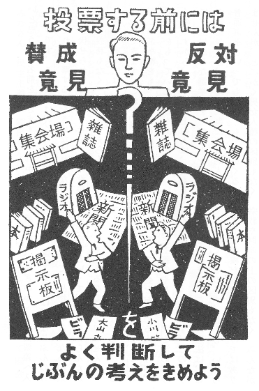

議員を選挙するには、選挙の日に投票所へ行き、投票用紙を受け取り、じぶんのよいと思う人の名前を書きます。それから、その紙を折り、かぎのかゝった投票箱へ入れるのです。この投票は、ひじょうに大事な権利です。選挙する人は、みなじぶんの考えでだれに投票するかをきめなければなりません。けっして、品物や利益になる約束で説き伏せられてはなりません。この投票は、秘密投票といって、だれをえらんだかをいう義務もなく、ある人をえらんだ理由を問われても答える必要はありません。

さて日本國民は、二十歳以上の人は、だれでも國会議員や知事市長などを選挙することができます。これを「選挙権」というのです。わが國では、ながいあいだ、男だけがこの選挙権をもっていました。また、財産をもっていて税金をおさめる人だけが、選挙権をもっていたこともありました。いまは、民主主義のやりかたで國を治めてゆくのですから、二十歳以上の人は、男も女もみんな選挙権をもっています。このように、國民がみな選挙権をもつことを、「普通選挙」といいます。こんどの憲法は、この普通選挙を、國民の大事な基本的人権としてみとめているのです。しかし、いくら普通選挙といっても、こどもや氣がくるった人まで[^2]選挙権をもつというわけではありませんが、とにかく男女人種の区別もなく、宗教や財産の上の区別もなく、みんながひとしく選挙権をもっているのです。

[^2]: 不適切な表現ですが原文のまま残してあります。

また日本國民は、だれでも國会の議員などになることができます。男も女もみな議員になれるのです。これを「被選挙権」といいます。しかし、年齢が、選挙権のときと少しちがいます。衆議院議員になるには、二十五歳以上、参議院議員になるには、三十歳以上でなければなりません。この被選挙権の場合も、選挙権と同じように、だれが考えてもいけないと思われる者には、被選挙権がありません。國会議員になろうとする人は、じぶんでとどけでて、「候補者」というものになるのです。また、じぶんがよいと思うほかの人を、「候補者」としてとゞけでることもあります。これを候補者を「推薦する」といいます。

この候補者をとゞけでるのは、選挙の日のまえにしめきってしまいます。投票をする人は、この候補者の中から、じぶんのよいと思う人をえらばなければなりません。ほかの人の名前を書いてはいけません。そうして、投票の数の多い候補者から、議員になれるのです。それを「当選する」といいます。

みなさん、民主主義は、國民ぜんたいで國を治めてゆくことです。そうして國会は、國民ぜんたいの代表者です。それで、國会議員を選挙することは、國民の大事な権利で、また大事なつとめです。國民はぜひ選挙にでてゆかなければなりません。選挙にゆかないのは、この大事な権利をすててしまうことであり、また大事なつとめをおこたることです。選挙にゆかないことを、ふつう「棄権」といいます。これは、権利をすてるという意味です。國民は棄権してはなりません。みなさんも、いまにこの権利をもつことになりますから、選挙のことは、とくにくわしく書いておいたのです。

國会は、このようにして、國民がえらんだ議員があつまって、國のことをきめるところですが、ほかの役所とちがって、國会で、議員が、國の仕事をしているありさまを、國民が知ることができるのです。國民はいつでも、國会へ行って、これを見たりきいたりすることができるのです。また、新聞やラジオにも國会のことがでます。

つまり、國会での仕事は、國民の目の前で行われるのです。憲法は、國会はいつでも、國民に知れるようにして、仕事をしなければならないときめているのです。これはたいへん大事なことです。もし、まれな場合ですが秘密に会議を開こうとするときは、むずかしい手つゞきがいります。

これで、どういうふうに國が治められてゆくのか、どんなことが國でおこっているのか、國民のえらんだ議員が、どんな意見を國会でのべているかというようなことが、みんな國民にわかるのです。

國の仕事の正しい明かるいやりかたは、こゝからうまれてくるのです。國会がなくなれば、國の中がくらくなるのです。民主主義は明かるいやりかたです。國会は、民主主義にはなくてはならないものです。

日本の國会は、年中開かれているものではありません。しかし、毎年一回はかならず開くことになっています。これを「常会」といいます。常会は百五十日間ときまっています。これを國会の「会期」といいます。このほかに、必要のあるときは、臨時に國会を開きます。これを「臨時会」といいます。また、衆議院が解散されたときは、解散の日から四十日以内に、選挙を行い、その選挙の日から三十日以内に、あたらしい國会が開かれます。これを「特別会」といいます。臨時会と特別会の会期は、國会がじぶんできめます。また國会の会期は、必要のあるときは、延ばすことができます。それも國会がじぶんできめるのです。國会を開くには、國会議員をよび集めなければなりません。これを、國会を「召集する」といって、天皇陛下がなさるのです。召集された國会は、じぶんで開いて仕事をはじめ、会期がおわれば、じぶんで國会を閉じて、國会は一時休むことになります。

みなさん、國会の議事堂をごぞんじですか。あの白いうつくしい建物に、日の光りがさしているのをごらんなさい。あれは日本國民の力をあらわすところです。主権をもっている日本國民が國を治めてゆくところです。

# 九 政党

「政党」というのは、國を治めてゆくことについて、同じ意見をもっている人があつまってこしらえた團体のことです。みなさんは、社会党、民主党、自由党、國民協同党、共産党などという名前を、きいているでしょう。これらはみな政党です。政党は、國会の議員だけでこしらえているものではありません。政党からでている議員は、政党をこしらえている人の一部だけです。ですから、一つの政党があるということは、國の中に、それと同じ意見をもった人が、そうとうおゝぜいいるということになるのです。

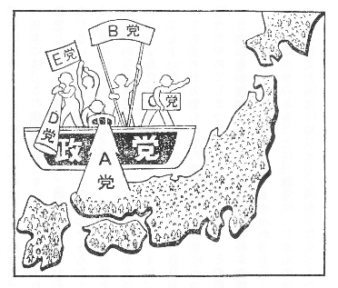

政党には、國を治めてゆくについてのきまった意見があって、これを國民に知らせています。國民の意見は、人によってずいぶんちがいますが、大きく分けてみると、この政党の意見のどれかになるのです。つまり政党は、國民ぜんたいが、國を治めてゆくについてもっている意見を、大きく色分けにしたものといってもよいのです。民主主義で國を治めてゆくには、國民ぜんたいが、みんな意見をはなしあって、きめてゆかなければなりません。政党がおたがいに國のことを議論しあうのはこのためです。

日本には、この政党というものについて、まちがった考えがありました。それは、政党というものは、なんだか、國の中で、じぶんの意見をいいはっているいけないものだというような見方です。これはたいへんなまちがいです。民主主義のやりかたは、國の仕事について、國民が、おゝいに意見をはなしあってきめなければならないのですから、政党が爭うのは、けっしてけんかではありません。民主主義でやれば、かならず政党というものができるのです。また、政党がいるのです。政党はいくつあってもよいのです。政党の数だけ、國民の意見が、大きく分かれていると思えばよいのです。ドイツやイタリアでは政党をむりに一つにまとめてしまい、また日本でも、政党をやめてしまったことがありました。その結果はどうなりましたか。國民の意見が自由にきかれなくなって、個人の権利がふみにじられ、とう／＼おそろしい戰爭をはじめるようになったではありませんか。

國会の選挙のあるごとに、政党は、じぶんの團体から議員の候補者を出し、またじぶんの意見を國民に知らせて、國会でなるべくたくさんの議員をえようとします。衆議院は、参議院よりも大きな力をもっていますから、衆議院でいちばん多く議員を、じぶんの政党から出すことが必要です。それで衆議院の選挙は、政党にとっていちばん大事なことです。國民は、この政党の意見をよくしらべて、じぶんのよいと思う政党の候補者に投票すれば、じぶんの意見が、政党をとおして國会にとどくことになります。

どの政党にもはいっていない人が、候補者になっていることもあります。國民は、このような候補者に投票することも、もちろん自由です。しかし政党には、きまった意見があり、それは國民に知らせてありますから、政党の候補者に投票をしておけば、その人が國会に出たときに、どういう意見をのべ、どういうふうにはたらくかということが、はっきりきまっています。もし政党の候補者でない人に投票したときは、その人が國会に出たとき、どういうようにはたらいてくれるかが、はっきりわからないふべんがあるのです。このようにして、選挙ごとに、衆議院に多くの議員をとった政党の意見で、國の仕事をやってゆくことになります。これは、いいかえれば、國民ぜんたいの中で、多いほうの意見で、國を治めてゆくことでもあります。

みなさん、國民は、政党のことをよく知らなければなりません。じぶんのすきな政党にはいり、またじぶんたちですきな政党をつくるのは、國民の自由で、憲法は、これを「基本的人権」としてみとめています。だれもこれをさまたげることはできません。

# 十 内閣

「内閣」は、國の行政をうけもっている機関であります。行政ということは、まえに申しましたように、「立法」すなわち國の規則をこしらえることと、「司法」すなわち裁判をすることをのぞいたあとの、國の仕事をまとめていうのです。國会は、國民の代表になって、國を治めてゆく機関ですが、たくさんの議員でできているし、また一年中開いているわけにもゆきませんから、日常の仕事やこま／″＼した仕事は、別に役所をこしらえて、こゝでとりあつかってゆきます。その役所のいちばん上にあるのが内閣です。

内閣は、内閣総理大臣と國務大臣とからできています。「内閣総理大臣」は内閣の長で、内閣ぜんたいをまとめてゆく、大事な役目をするのです。それで、内閣総理大臣にだれがなるかということは、たいへん大事なことですが、こんどの[^3]憲法は、内閣総理大臣は、國会の議員の中から、國会がきめて、天皇陛下に申しあげ、天皇陛下がこれをお命じになることになっています。國会できめるとき、衆議院と参議院の意見が分かれたときは、けっきょく衆議院の意見どおりにきめることになります。内閣総理大臣を國会できめるということは、衆議院でたくさんの議員をもっている政党の意見で、きまることになりますから、内閣総理大臣は、政党からでることになります。

[^3]: 「こんどの」は底本では「こんごの」

また、ほかの國務大臣は、内閣総理大臣が、自分でえらんで國務大臣にします。しかし、國務大臣の数の半分以上は、國会の議員からえらばなければなりません。國務大臣は國の行政をうけもつ役目がありますが、この國務大臣の中から、大蔵省、文部省、厚生省、商工省などの國の役所の長になって、その役所の仕事を分けてうけもつ人がきまります。これを「各省大臣」といいます。つまり國務大臣の中には、この各省大臣になる人と、たゞ國の仕事ぜんたいをみてゆく國務大臣とがあるわけです。内閣総理大臣が政党からでる以上、國務大臣もじぶんと同じ政党の人からとることが、國の仕事をやってゆく上にべんりでありますから、國務大臣の大部分が、同じ政党からでることになります。

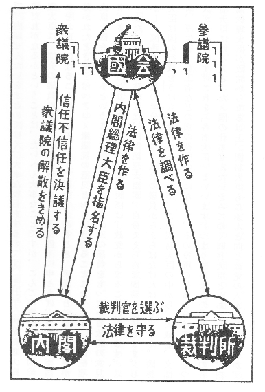

また、一つの政党だけでは、國会に自分の意見をとおすことができないと思ったときは、意見のちがうほかの政党と組んで内閣をつくります。このときは、それらの政党から、みな國務大臣がでて、いっしょに、國の仕事をすることになります。また政党の人でなくとも、國の仕事に明かるい人を、國務大臣に入れることもあります。しかし、民主主義のやりかたでは、けっきょく政党が内閣をつくることになり、政党から内閣総理大臣と國務大臣のおゝぜいがでることになるので、これを「政党内閣」というのです。

内閣は、國の行政をうけもち、また、天皇陛下が國の仕事をなさるときには、これに意見を申しあげ、また、御同意を申します。そうしてじぶんのやったことについて、國民を代表する國会にたいして、責任を負うのです。これは、内閣総理大臣も、ほかの國務大臣も、みないっしょになって、責任を負うのです。ひとり／＼べつ／″＼に責任を負うのではありません。これを「連帯して責任を負う」といいます。

また國会のほうでも、内閣がわるいと思えば、いつでも「もう内閣を信用しない」ときめることができます。たゞこれは、衆議院だけができることで、参議院はできません。なぜならば、國民のその時々の意見がうつっているのは、衆議院であり、また、選挙のやり直しをして、内閣が、國民に、どっちがよいかをきめてもらうことができるのは、衆議院だけだからです。衆議院が内閣にたいして、「もう内閣を信用しない」ときめることを、「不信任決議」といいます。この不信任決議がきまったときは、内閣は天皇陛下に申しあげ、十日以内に衆議院を解散していただき、選挙のやり直しをして、國民にうったえてきめてもらうか、または辞職するかどちらかになります。また「内閣を信用する」ということ（これを「信任決議」といいます）が、衆議院で反対されて、だめになったときも同じことです。

このようにこんどの憲法では、内閣は國会とむすびついて、國会の直接の力で動かされることになっており、國会の政党の勢力の変化で、かわってゆくのです。つまり内閣は、國会の支配の下にあることになりますから、これを「議院内閣制度」とよんでいます。民主主義と、政党内閣と、議院内閣とは、ふかい関係があるのです。

# 十一 司法

「司法」とは、爭いごとをさばいたり、罪があるかないかをきめることです。「裁判」というのも同じはたらきをさすのです。だれでも、じぶんの生命、自由、財産などを守るために、公平な裁判をしてもらうことができます。この司法という國の仕事は、國民にとってはたいへん大事なことで、何よりもまず、公平にさばいたり、きめたりすることがたいせつであります。そこで國には、「裁判所」というものがあって、この司法という仕事をうけもっているのです。

裁判所は、その仕事をやってゆくについて、ただ憲法と國会のつくった法律とにしたがって、公平に裁判をしてゆくものであることを、憲法できめております。ほかからは、いっさい口出しをすることはできないのです。また、裁判をする役目をもっている人、すなわち「裁判官」は、みだりに役目を取りあげられないことになっているのです。これを「司法権の独立」といいます。また、裁判を公平にさせるために、裁判は、だれでも見たりきいたりすることができるのです。これは、國会と同じように、裁判所の仕事が國民の目の前で行われるということです。これも憲法ではっきりときめてあります。

こんどの憲法で、ひじょうにかわったことを、一つ申しておきます。それは、裁判所は、國会でつくった法律が、憲法に合っているかどうかをしらべることができるようになったことです。もし法律が、憲法にきめてあることにちがっていると考えたときは、その法律にしたがわないことができるのです。だから裁判所は、たいへんおもい役目をすることになりました。

みなさん、私たち國民は、國会を、じぶんの代わりをするものと思って、しんらいするとともに、裁判所を、じぶんたちの権利や自由を守ってくれるみかたと思って、そんけいしなければなりません。

# 十二 財政

みなさんの家に、それ／″＼くらしの立てかたがあるように、國にもくらしの立てかたがあります。これが國の「財政」です。國を治めてゆくのに、どれほど費用がかゝるか、その費用をどうしてとゝのえるか、とゝのえた費用をどういうふうにつかってゆくかというようなことは、みな國の財政です。國の費用は、國民が出さなければなりませんし、また、國の財政がうまくゆくかゆかないかは、たいへん大事なことですから、國民は、はっきりこれを知り、またよく監督してゆかなければなりません。

そこで憲法では、國会が、國民に代わって、この監督の役目をすることにしています。この監督の方法はいろ／＼ありますが、そのおもなものをいいますと、内閣は、毎年いくらお金がはいって、それをどういうふうにつかうかという見つもりを、國会に出して、きめてもらわなければなりません。それを「予算」といいます。また、つかった費用は、あとで計算して、また國会に出して、しらべてもらわなければなりません。これを「決算」といいます。國民から税金をとるには、國会に出して、きめてもらわなければなりません。内閣は、國会と國民にたいして、少なくとも毎年一回、國の財政が、どうなっているかを、知らさなければなりません。このような方法で、國の財政が、國民と國会とで監督されてゆくのです。

また「会計檢査院」という役所があって、國の決算を檢査しています。

# 十三 地方自治

戰爭中は、なんでも「國のため」といって、國民のひとり／＼のことが、かるく考えられていました。しかし、國は國民のあつまりで、國民のひとり／＼がよくならなければ、國はよくなりません。それと同じように、日本の國は、たくさんの地方に分かれていますが、その地方が、それ／″＼さかえてゆかなければ、國はさかえてゆきません。そのためには、地方が、それ／″＼じぶんでじぶんのことを治めてゆくのが、いちばんよいのです。なぜならば、地方には、その地方のいろ／＼な事情があり、その地方に住んでいる人が、いちばんよくこれを知っているからです。じぶんでじぶんのことを自由にやってゆくことを「自治」といいます。それで國の地方ごとに、自治でやらせてゆくことを、「地方自治」というのです。

こんどの憲法では、この地方自治ということをおもくみて、これをはっきりきめています。地方ごとに一つの團体になって、じぶんでじぶんの仕事をやってゆくのです。東京都、北海道、府県、市町村など、みなこの團体です。これを「地方公共團体」といいます。

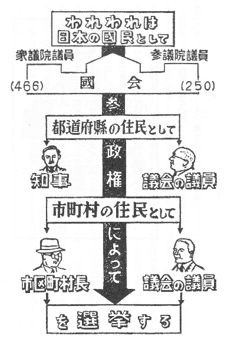

もし國の仕事のやりかたが、民主主義なら、地方公共團体の仕事のやりかたも、民主主義でなければなりません。地方公共團体は、國のひながたといってもよいでしょう。國に國会があるように、地方公共團体にも、その地方に住む人を代表する「議会」がなければなりません。また、地方公共團体の仕事をする知事や、その他のおもな役目の人も、地方公共團体の議会の議員も、みなその地方に住む人が、じぶんで選挙することに[^4]なりました。

[^4]: 「選挙することに」は底本では「選挙すことに」

このように地方自治が、はっきり憲法でみとめられましたので、ある一つの地方公共團体だけのことをきめた法律を、國の國会でつくるには、その地方に住む人の意見をきくために、投票をして、その投票の半分以上の賛成がなければできないことになりました。

みなさん、國を愛し國につくすように、じぶんの住んでいる地方を愛し、じぶんの地方のためにつくしましょう。地方のさかえは、國のさかえと思ってください。

# 十四 改正

「改正」とは、憲法をかえることです。憲法は、まえにも申しましたように、國の規則の中でいちばん大事なものですから、これをかえる手つづきは、げんじゅうにしておかなければなりません。

そこでこんどの憲法では、憲法を改正するときは、國会だけできめずに、國民が、賛成か反対かを投票してきめることにしました。

まず、國会の一つの議院で、ぜんたいの議員の三分の二以上の賛成で、憲法をかえることにきめます。これを、憲法改正の「発議」というのです。それからこれを國民に示して、賛成か反対かを投票してもらいます。そうしてぜんぶの投票の半分以上が賛成したとき、はじめて憲法の改正を、國民が承知したことになります。これを國民の「承認」といいます。國民の承認した改正は、天皇陛下が國民の名で、これを國に発表されます。これを改正の「公布」といいます。あたらしい憲法は、國民がつくったもので、國民のものですから、これをかえたときも、國民の名義で発表するのです。

# 十五 最高法規

このおはなしのいちばんはじめに申しましたように、「最高法規」とは、國でいちばん高い位にある規則で、つまり憲法のことです。この最高法規としての憲法には、國の仕事のやりかたをきめた規則と、國民の基本的人権をきめた規則と、二つあることもおはなししました。この中で、國民の基本的人権は、これまでかるく考えられていましたので、憲法第九十七條は、おごそかなことばで、この基本的人権は、人間がながいあいだ力をつくしてえたものであり、これまでいろ／＼のことにであってきたえあげられたものであるから、これからもけっして侵すことのできない永久の権利であると記しております。

憲法は、國の最高法規ですから、この憲法できめられてあることにあわないものは、法律でも、命令でも、なんでも、いっさい規則としての力がありません。これも憲法がはっきりきめています。

このように大事な憲法は、天皇陛下もこれをお守りになりますし、國務大臣も、國会の議員も、裁判官も、みなこれを守ってゆく義務があるのです。また、日本の國がほかの國ととりきめた約束（これを「條約」といいます）も、國と國とが交際してゆくについてできた規則（これを「國際法規」といいます）も、日本の國は、まごころから守ってゆくということを、憲法できめました。

みなさん、あたらしい憲法は、日本國民がつくった、日本國民の憲法です。これからさき、この憲法を守って、日本の國がさかえるようにしてゆこうではありませんか。

おわり

---

底本：「あたらしい憲法のはなし」日本平和委員会  
1972（昭和47）年11月3日初版発行  
2004（平成16）年1月27日第38版

底本の親本：「あたらしい憲法のはなし」実業教科書株式会社  
1947（昭和22）年7月28日同日翻刻印刷  
1947（昭和22）年8月2日同日翻刷発行  
1947（昭和22）年8月2日文部省検査済

※「／＼」と「／″＼」の使い方は、底本通りにしました。

入力：林 幸雄  
校正：松永正敏  
2004年6月9日作成  
2013年6月7日修正  

青空文庫作成ファイル： [43037_txt_15619.zip](http://www.aozora.gr.jp/cards/001128/files/43037_txt_15619.zip)

このファイルは、インターネットの図書館、[青空文庫](http://www.aozora.gr.jp/)で作られました。入力、校正、制作にあたったのは、ボランティアの皆さんです。

あたらしい憲法のはなし(Markdown版): <https://github.com/nogajun/story_of_the_new_constitution>  
野方純(@nogajun) <nogajun@gmail.com>

